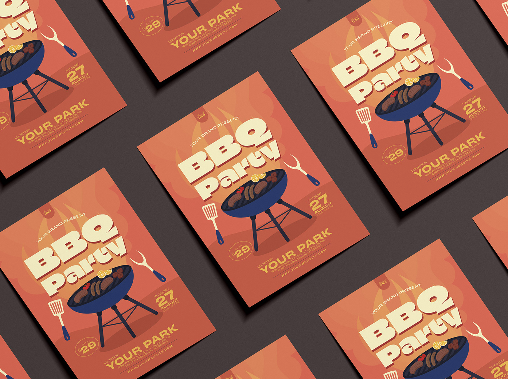

# Coding Major Functioning prototype
## Coco LI  540413797  keli0103


### Part 1:Personal Work Description

I chose a time-based animation approach, using timers and events to add special effects to my personal code, creating a dynamic visual experience.

At the start of the animation, the screen is a blank pink canvas, and then, plates with random food patterns begin to appear from the top-left corner. Each plate has a different random design, adding an element of unpredictability and fun. Meanwhile, medicine appears at random locations in the background, with its position refreshing over time. Although the medicine is small and subtle, it always stays present, serving as a quiet reminder. Once a row of plates is filled, the plates will follow the same placement order in the next diagonal row, until the plates nearly cover the entire screen, and no new plates appear. This creates a dynamic, rhythmic layout.

Throughout this process, viewers' attention is typically drawn to the plates with the largest movements. This movement not only emphasizes the strong allure of food but also symbolizes the overwhelming temptation of unhealthy eating in life. Just as in real life, people are often distracted by the question of what delicious food to eat today, continuously attracted by tempting foods while neglecting healthy eating habits. However, the medicine placed beneath the plates, though small, cannot be ignored. It serves as a constant reminder that indulgent eating habits can lead to health risks, and if left unaddressed, these risks can accumulate and result in serious consequences. Through this design, I aim to further highlight the importance of a healthy lifestyle, urging the audience to pay attention to the long-term impact of eating habits on health.


### Part 2: Details of my individual approach to animating the group code & Technical Explanation 


The animation I created is designed to make all plates move diagonally toward the upper-right corner. In the group code, plate positions were stored using specific points in an array. Directly using these positions to animate the plates resulted in gaps appearing on the canvas when they moved far enough upward. Additionally, since these positions were roughly estimated rather than calculated precisely, the plates often overlapped during movement.

To address these issues, I removed the original position array, leaving it empty, and then used a `for` loop to recalculate each plate’s position, arranging them sequentially from the top left to the bottom right of the canvas. Compared to the original group code, this approach alters the direction of alignment slightly, creating a layout that differs from the initial image. However, the recalculated positions are more precise, giving the animation a more consistent and visually coherent dynamic effect.

``` 
// Loop to draw each plate
  for (let i = 0; i < plates.length; i++) {
    let plate = plates[i];
    // Initialize drawing style for plates
    noFill();
    noStroke();
    // Determine plate drawing based on its type
    plate.x = plate.x + moveSpeed * sin(PI / 4); // Move plate along x-axis
    plate.y = plate.y - moveSpeed * cos(PI / 4); // Move plate along y-axis
    // Reset plate position when it goes off the canvas
    if (plate.y <= 0 - PlateRatio / 2) {
      plate.y = plate.x + sqrt(2) * PlateRatio;
      plate.x = 0 - PlateRatio / 2;
      if (plate.y >= 2) {
        plate.x = plate.y = -sqrt(2) / 4 * PlateRatio;
      }
    }
    switch (plate.type) {
      case 1:
        drawPinkPlate(plate.x, plate.y, PlateDiameter, side)
        break;
      case 2:
        drawYellowPlate(plate.x, plate.y, PlateDiameter, side)
        break;
      case 3:
        drawPurplePlate(plate.x, plate.y, PlateDiameter, side)
        break;
      case 4:
        drawBluePlate(plate.x, plate.y, PlateDiameter, side)
        break;
      case 5:
        drawGreenPlate(plate.x, plate.y, PlateDiameter, side)
        break;
      case 6:
        drawHotpot(plate.x, plate.y, PlateRatio, side)
        break;
      case 7:
        drawRainbowPlate(plate.x, plate.y, PlateDiameter, side)
        break;
    }
  }
```
``` 
// Loop to draw each food item
  for (let i = 0; i < foods.length; i++) {
    let food = foods[i];
    // Initialize drawing style for food
    noFill();
    noStroke();
    // Determine food drawing based on its type
    food.x = food.x + moveSpeed * sin(PI / 4);
    food.y = food.y - moveSpeed * cos(PI / 4);
    if (food.y <= 0 - PlateRatio / 2) {
      food.y = food.x + sqrt(2) * PlateRatio;
      food.x = 0 - PlateRatio / 2;
      if (food.y >= 2) {
        food.x = food.y = -sqrt(2) / 4 * PlateRatio;
      }
    }
    switch (food.type) {
      case 1:
        drawSushi(food.x, food.y, PlateDiameter, side)
        break;
      case 2:
        drawCurry(food.x, food.y, PlateDiameter, side)
        break;
      case 3:
        drawPudding(food.x, food.y, PlateDiameter, side)
        break;
      case 4:
        drawLightDonut(food.x, food.y, PlateDiameter, side)
        break;
      case 5:
        drawBurger(food.x, food.y, PlateDiameter, side)
        break;
      case 6:
        drawSushi(food.x, food.y, PlateDiameter, side)
        break;
      case 7:
        drawLimeCake(food.x, food.y, PlateDiameter, side)
        break;
      case 8:
        drawToast(food.x, food.y, PlateDiameter, side)
        break;
      case 9:
        drawDarkDonut(food.x, food.y, PlateDiameter, side)
        break;
      case 10:
        drawPizza(food.x, food.y, PlateDiameter, side)
        break;
      case 11:
        drawLimeCake(food.x, food.y, PlateDiameter, side)
        break;
    }
  }
```
<div align="center">
  
  
</div>

Additionally, I created a new array to store the states of the pills, using timers and sequential placement to prevent them from flashing across the screen in a way that would be visually overwhelming. Since I didn’t incorporate any keyboard or mouse interactions, relying instead on random functions rather than Perlin noise, and chose a different motion style from my group members, this approach helps highlight the unique qualities of my work.

```
  // Loop to control the number of pills
  if (millis()-lasttime>1000){
    lasttime = millis();
    capsules = [];
    for (let i = 0; i < 0.6 * side; i++) {
      let x = random(0, 1); // Random x position
      let y = random(0, 1); // Random y position

      // Define colors for the capsules and pills
      let color1 = color(255, 152, 129); // Capsule top color
      let color2 = color(254, 254, 162); // Capsule bottom color
      let color3 = color(139, 195, 219); // Pill color
      let color4 = color(255); // Secondary pill color

    // Generate a random angle for the capsules
      let angle = random(TWO_PI);

      capsules.push({x:x, y:y, c1:color1, c2:color2, c3:color3, c4:color4, angle, angle})
    }
  }

    for (let i = 0; i < capsules.length; i++) {
      capsule = capsules[i]
    // Draw capsules and pills
    // Capsule drawing
      drawCapsule(capsule.x, capsule.y, 0.25 * side, side, capsule.c1, capsule.c2, capsule.angle);

      //Pill drawing (can add more variations in size and color here)
      fill(capsule.c3);
      noStroke();
      circle((capsule.x + 0.1) * side, (capsule.y + 0.1) * side, 0.015 * side)

      fill(capsule.c4);
      circle((capsule.x + 0.05) * side, (capsule.y + 0.07) * side, 0.01 * side)

  }

```

### Part 3: inspiration for animating my individual code

When I first saw the painting *Wheels of Fortune* (Figure 1), I was immediately drawn to its vibrant, shifting colors, which felt almost overwhelming at first glance. The circular elements seem to be scattered in an orderly yet unpredictable fashion; when viewed horizontally or vertically, none align along a single line, yet their overall arrangement evokes a sense of harmony and comfort. Upon closer observation, as I began to look past the visual distraction of its vivid colors, I noticed that these elements are actually aligned diagonally, a subtle pattern that I found truly captivating.

<div align="center">
  
</div>
<div align="center">
Figure 1. Wheels of Fortune
<p></p>
</div>

This diagonal composition reminded me of a commonly used visual layout technique in product design (Figures 2 and 3), where diagonal lines are strategically employed to create dynamic visual effects that captivate the viewer’s attention. Additionally, I was inspired by the flowing motion of film reels I observed in Figure 4 within Canva’s animation resource library. I realized that this natural, flowing movement could create an immersive, almost cinematic experience for the viewer, even without requiring keyboard or mouse interaction. This rhythmic, diagonal motion infused an unexpected interactive quality into the piece, sparking the idea to incorporate a similar diagonal alignment and flowing effect in my own work.

<div align="center">
 
</div>
<div align="center">
 Figure 2. Packaging Design for Juicy Sparkling Fruit Infusion Water
</div>
<p></p>
<div align="center">
  
</div>
<div align="center">
Figure 3. BBQ Party Flyer-Fathur Rahman
</div>
<p></p>

### Part 4: Reference URL：
http://learn.digitalharbor.org/courses/creative-programming/lessons/using-timers-in-p5-js/<br>
https://p5js.org/reference/p5/pow/<br>
https://p5js.org/reference/p5/sqrt/<br>
https://p5js.org/reference/p5/quad/<br>
https://markdown.com.cn/basic-syntax/line-breaks.html<br>

